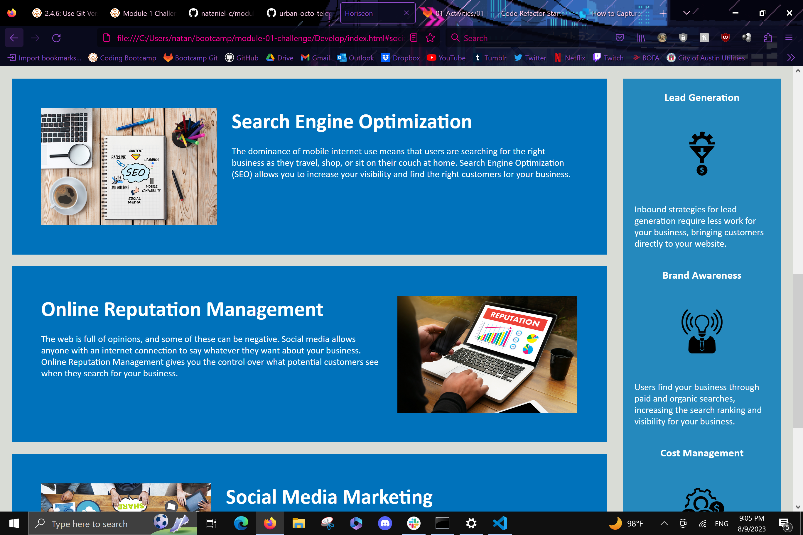
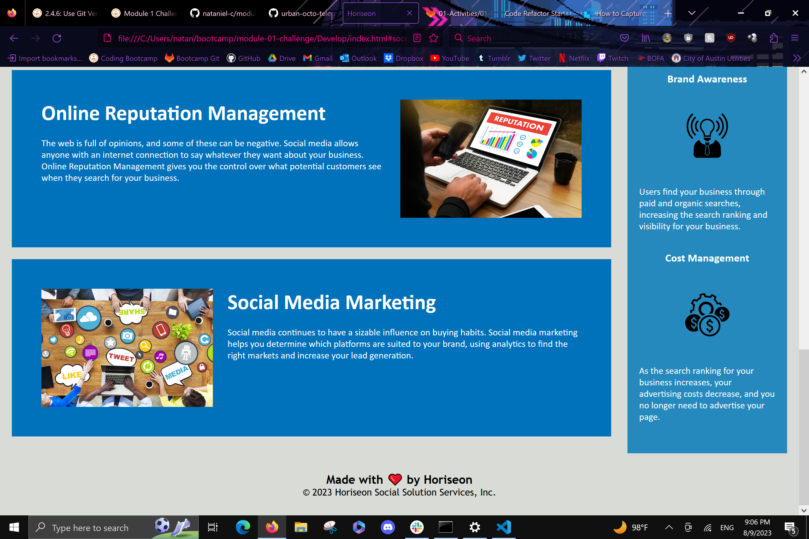

# Code Refactor Starter Code

## Description
The given codebase is used to create a webpage for the business Horiseon and follows accessibility standards.

AS A marketing agency
I WANT a codebase that follows accessibility standards
SO THAT our own site is optimized for search engines

## Website Link
https://nataniel-c.github.io/module-01-challenge/

## Website Screenshots

---

---

---